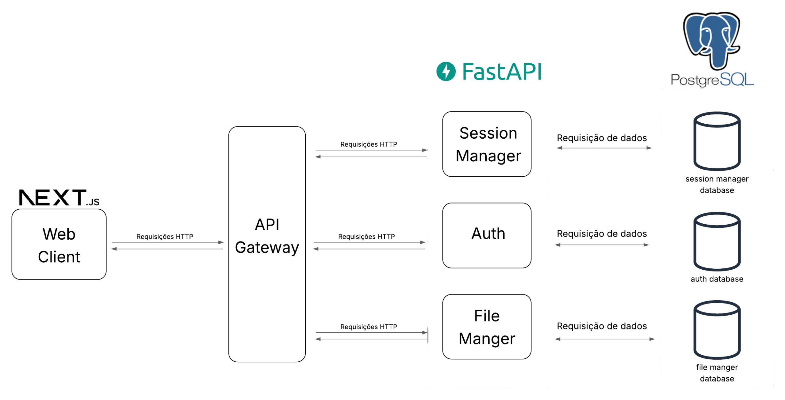

## **Documento de Arquitetura de Software**

**Histórico de Revisão**

|Data|Versão|Descrição|Autor(es)|
|----|------|---------|---------|
|15/05/2025|0.1|Versão inicial|[Philipe Sousa](https://github.com/PhilipeSousa)|

## 1. Introdução

### 1.1 Finalidade
Este documento tem como propósito apresentar uma visão geral da arquitetura de software da plataforma **EasyCrit**, detalhando as principais decisões arquiteturais adotadas durante seu desenvolvimento. O documento serve como referência para orientar a equipe técnica ao longo do projeto, promovendo consistência e alinhamento com os objetivos da aplicação.

### 1.2 Escopo
O **EasyCrit** é uma aplicação web desenvolvida por estudantes da Universidade de Brasília (UnB), voltada para a prática de RPG de mesa em ambiente virtual. A plataforma busca oferecer uma experiência acessível, intuitiva e eficiente para jogadores e mestres de RPG, facilitando a organização de sessões e a interação entre os participantes. Este documento contempla os aspectos técnicos essenciais da arquitetura do sistema, estabelecendo diretrizes que devem ser seguidas durante seu desenvolvimento.

## 2. Visão Geral da Arquitetura

### 2.1 Descrição Geral

A arquitetura do **EasyCrit** é baseada em microsserviços, buscando garantir modularidade, escalabilidade e facilidade de manutenção. A comunicação entre os componentes é realizada por meio de requisições HTTP, centralizadas através de um API Gateway, que atua como ponto de entrada principal para o cliente web.

A aplicação é dividida nas seguintes camadas:

- **Frontend**: Interface web desenvolvida com Next.js.
- **API Gateway**: Intermediário que direciona as requisições do frontend para os microsserviços apropriados.
- **Microsserviços (FastAPI)**:
  - **Session Manager**: Responsável pelo gerenciamento das sessões de jogo.
  - **Auth**: Responsável pelo controle de autenticação e autorização dos usuários.
  - **File Manager**: Gerencia arquivos enviados e utilizados durante as sessões (como fichas, imagens, etc).
- **Banco de Dados (PostgreSQL)**: Cada microsserviço possui seu próprio banco de dados PostgreSQL, garantindo isolamento e independência entre domínios.

### 2.2 Diagrama de Relações

