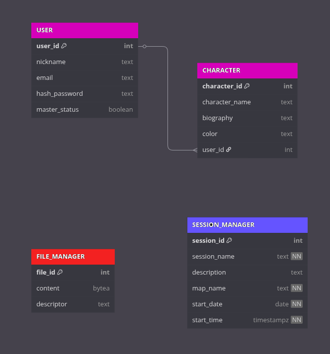

## **Documento de Arquitetura de Software**

**Histórico de Revisão**

|Data|Versão|Descrição|Autor(es)|
|----|------|---------|---------|
|15/05/2025|0.1|Versão inicial|[Philipe Sousa](https://github.com/PhilipeSousa)|
|16/05/2025|0.2|Adiciona Diagrama de sequência|[Philipe Sousa](https://github.com/PhilipeSousa)|
|17/05/2025|0.3|Adiciona estrutura de pastas FastAPI|[Kess Jhones](https://github.com/KessJhones)|

## 1. Introdução

### 1.1 Finalidade
Este documento tem como propósito apresentar uma visão geral da arquitetura de software da plataforma **EasyCrit**, detalhando as principais decisões arquiteturais adotadas durante seu desenvolvimento. O documento serve como referência para orientar a equipe técnica ao longo do projeto, promovendo consistência e alinhamento com os objetivos da aplicação.

### 1.2 Escopo
O **EasyCrit** é uma aplicação web desenvolvida por estudantes da Universidade de Brasília (UnB), voltada para a prática de RPG de mesa em ambiente virtual. A plataforma busca oferecer uma experiência acessível, intuitiva e eficiente para jogadores e mestres de RPG, facilitando a organização de sessões e a interação entre os participantes. Este documento contempla os aspectos técnicos essenciais da arquitetura do sistema, estabelecendo diretrizes que devem ser seguidas durante seu desenvolvimento.

---

## 2. Representação da Arquitetura

### 2.1 Descrição Geral

A arquitetura do **EasyCrit** é baseada em microsserviços, buscando garantir modularidade, escalabilidade e facilidade de manutenção. A comunicação entre os componentes é realizada por meio de requisições HTTP, centralizadas através de um API Gateway, que atua como ponto de entrada principal para o cliente web.

A aplicação é dividida nas seguintes camadas:

- **Frontend**: Interface web desenvolvida com Next.js.
- **API Gateway**: Intermediário que direciona as requisições do frontend para os microsserviços apropriados.
- **Microsserviços (FastAPI)**:
  - **Session Manager**: Responsável pelo gerenciamento das sessões de jogo.
  - **Auth**: Responsável pelo controle de autenticação e autorização dos usuários.
  - **File Manager**: Gerencia arquivos enviados e utilizados durante as sessões (como fichas, imagens, etc).
- **Banco de Dados (PostgreSQL)**: Cada microsserviço possui seu próprio banco de dados PostgreSQL, garantindo isolamento e independência entre domínios.

### 2.2 Diagrama de Relações

*Diagrama elaborado por Kess, 2025.*

### 2.3 Backend: FastAPI

O FastAPI é o framework adotado no backend da aplicação EasyCrit devido à sua alta performance, simplicidade, suporte nativo a operações assíncronas e à familiaridade da equipe de desenvolvedores com a tecnologia.

### Estrutura Interna

*Diagrama elaborado por Kess, 2025.*

#### Descrição da Estrutura de Pastas

A estrutura de pastas dos microsserviços segue um padrão organizado e modular:

> **Nota sobre os arquivos `__init__.py`**: Estes arquivos estão presentes em vários diretórios do projeto e servem para identificar os diretórios como pacotes Python, permitindo a importação de módulos entre diferentes partes da aplicação.

- **`service/`**: Diretório principal do microsserviço
  - **`app/`**: Contém toda a lógica de aplicação
    - **`main.py`**: Ponto de entrada da aplicação FastAPI
    - **`models.py`**: Define os modelos de dados (entidades) utilizados em conjunto com o ORM (SQLAlchemy) para mapear as tabelas do banco de dados para objetos Python
    - **`schemas.py`**: Define os esquemas de validação e serialização usando Pydantic
    
    - **`routers/`**: Contém as definições de rotas da API
      - Diversos arquivos que organizam as rotas por funcionalidade
      
    - **`database/`**: Gerencia a conexão e operações com o banco de dados
      - **`database.py`**: Configuração de conexão com o banco de dados
  
  - **`tests/`**: Contém os testes automatizados do serviço
    - Diversos arquivos organizados por funcionalidade
  
  - **`Dockerfile`**: Instruções para a criação da imagem Docker
  - **`requirements.txt`**: Dependências Python necessárias
  - **`README.md`**: Documentação específica do microsserviço

Esta estrutura foi projetada para promover a separação de responsabilidades, facilitar a manutenção e permitir o crescimento sustentável de cada microsserviço.

### 2.4 Frontend: Next.JS 

O **Next.js** é o framework escolhido para o desenvolvimento do frontend da aplicação **EasyCrit**. Construído sobre o **React**, o Next.js oferece um ambiente moderno para criação de interfaces web robustas.

A escolha pelo Next.js se deve à sua flexibilidade, suporte à renderização híbrida (SSR, SSG, ISR), roteamento automático baseado em arquivos e à integração facilitada com APIs REST e outras fontes de dados.

---

#### Principais Características Utilizadas

- **Pages-based routing**  
  Cada arquivo `.tsx` na pasta `/pages` representa uma rota da aplicação. O roteamento é automático, baseado na estrutura de diretórios.

- **Renderização Híbrida**
  - **SSR (Server Side Rendering)**: Utilizado para páginas que precisam de dados atualizados a cada requisição.
  - **SSG (Static Site Generation)**: Usado para páginas que não precisam ser atualizadas com frequência, melhorando a performance e o tempo de carregamento.

- **API Routes**  
  Caso necessário, é possível definir rotas de backend leves diretamente em `/pages/api`.

- **Static Files**  
  Arquivos estáticos como imagens, ícones e outros recursos são armazenados na pasta `/public`.

#### Estrutura Geral do Projeto

- **`/public/`** → Arquivos públicos (imagens, ícones, etc.)
- **`/src/app/`** → Estrutura de rotas baseada em arquivos (App Router)
- **`/src/components/`** → Componentes reutilizáveis (Header, Footer, etc.)
- **`/src/styles/`** → Estilização global e módulos CSS
- **`/src/services/`** → Funções para chamadas à API do backend FastAPI
- **`/src/hooks/`** → Hooks customizados (ex: useAuth, useFetch)
- **`/src/contexts/`** → Contextos globais (auth, tema, etc.)

---

### 3. Diagrama de Sequência

O diagrama de sequência a seguir demonstra a interação entre os principais componentes do sistema durante o processo descrito. O modelo foi elaborado pelo autor com base no comportamento esperado da aplicação.

*Diagrama elaborado por Philipe, 2025.*

### 4. Diagrama Lógico do Banco de Dados

