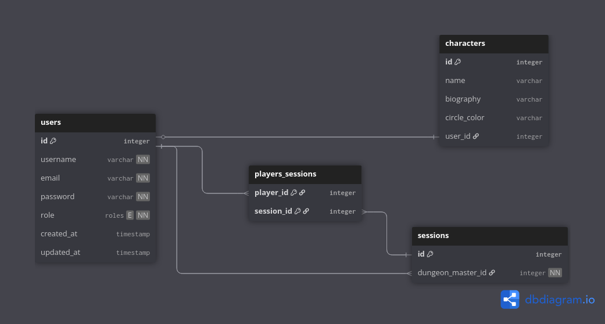
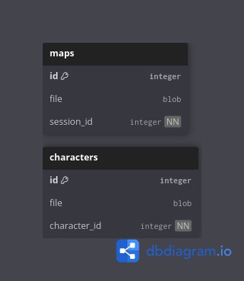

## **Diagrama Entidade-Relacionamento (DER)**

**Histórico de Revisão**

|Data|Versão|Descrição|Autor(es)|
|----|------|---------|---------|
|08/07/2025|0.1|Criação do documento descrevendo o Diagrama Entidade-Relacionamento.|Matheus Pimentel|

## 1. Introdução

### 1.1. Finalidade
Este documento tem como objetivo detalhar o Diagrama Entidade-Relacionamento (DER) do sistema EasyCrit, descrevendo as entidades, seus atributos e os relacionamentos entre elas. O DER é fundamental para a modelagem do banco de dados e para o entendimento da estrutura de dados da aplicação.

### 1.2. Databases
O desacoplamento dos dados relativos a cada microserviço foi movido para a camada de schemas, portanto optou-se pela utilização um banco de dados chamado `easycrit`, com a separação de schemas para cada microserviço relavante.

### 1.3. Schemas
Para o micrserviço de autenticação, o schema `main` foi criado contendo dados relativos aos usuários, personagens e sessões. E para o microserviço de gestão de arquivos, o schema `files` foi criado, contendo duas tabelas, uma para guardar os arquivos referentes aos mapas e outra para guardar os arquivos referentes aos personagens.

### 1.4. Escopo
O escopo deste documento abrange as principais entidades do sistema EasyCrit, sendo elas: `users`, `characters`, `sessions`, `players_sessions`, `characters` (files) e `maps`. A descrição detalhada de cada uma dessas entidades e seus relacionamentos visa fornecer uma visão clara e abrangente da arquitetura de dados do sistema.

### 2.  Diagramas

---

## 3. Descrição das Entidades

A seguir, são descritas as principais entidades do sistema EasyCrit.

### 3.1. users
A entidade `users`, no schema `main` do banco de dados representa os usuários do sistema, que podem ser tanto mestres quanto jogadores.

- `id` (Chave Primária): Identificador único para cada usuário.
- `username`: Nome de usuário único.
- `email`: E-mail único do usuário, utilizado para login e comunicação.
- `password`: Senha do usuário, armazenada de forma segura (hash).
- `role`: Define o tipo de usuário (ENUM: 'dungeon master', 'player').
- `created_at`: Data de criação do registro.
- `updated_at`: Data da última atualização do registro.

### 3.2. characters
A entidade `characters`, no schema `main` do banco de dados, representa um personagem criado por um jogador.

- `id` (Chave Primária): Identificador único para cada personagem.
- `name`: Nome do personagem.
- `biography`: Biografia do personagem.
- `circle_color`: Cor do círculo do personagem.
- `user_id` (Chave Estrangeira): Referência ao `id` do usuário que criou o personagem.

### 3.3. sessions
A entidade `sessions`, no schema `main` do banco de dados representa uma sessão de jogo.

- `id` (Chave Primária): Identificador único para cada sessão.
- `dungeon_master_id` (Chave Estrangeira): Referência ao `id` do usuário (mestre) que criou a sessão.

### 3.4. players_sessions
Esta é uma tabela associativa que relaciona os jogadores (`users`) a uma sessão (`sessions`).

- `player_id` (Chave Primária, Chave Estrangeira): Referência ao `id` do usuário (jogador).
- `session_id` (Chave Primária, Chave Estrangeira): Referência ao `id` da sessão.

### 3.5. maps
A entidade `maps`, no schema `files` do banco de dados representa um mapa utilizado em uma sessão.

- `id` (Chave Primária): Identificador único para cada mapa.
- `file`: Arquivo do mapa (blob).
- `session_id` (Chave Estrangeira): Referência ao `id` da sessão à qual o mapa pertence.

### 3.6. characters (Files)
A entidade `characters`, no schema `files` do banco de dados, armazena arquivos associados a um personagem, como a ficha ou uma imagem.

- `id` (Chave Primária): Identificador único para o arquivo.
- `file`: Arquivo (blob).
- `character_id` (Chave Estrangeira): Referência ao `id` do personagem.

---

## 4. Relacionamentos

A seguir, são descritos os principais relacionamentos entre as entidades do sistema.

- **users e characters**: Um `user` pode ter vários `characters`, mas cada `character` pertence a apenas um `user`. (Relacionamento 1 para N)
- **users e sessions (como mestre)**: Um `user` (mestre) pode criar várias `sessions`, mas cada `session` é criada por apenas um `user` (mestre). (Relacionamento 1 para N)
- **users e sessions (como jogador)**: Um `user` (jogador) pode participar de várias `sessions`, e uma `session` pode ter vários `users` (jogadores). (Relacionamento N para N, implementado pela tabela `players_sessions`)
- **sessions e maps**: Uma `session` pode ter vários `maps`, mas cada `map` pertence a apenas uma `session`. (Relacionamento 1 para N)
- **characters e character_files**: Um `character` pode ter vários `character_files` (arquivos), mas cada `character_file` pertence a um único `character`. (Relacionamento 1 para N)
