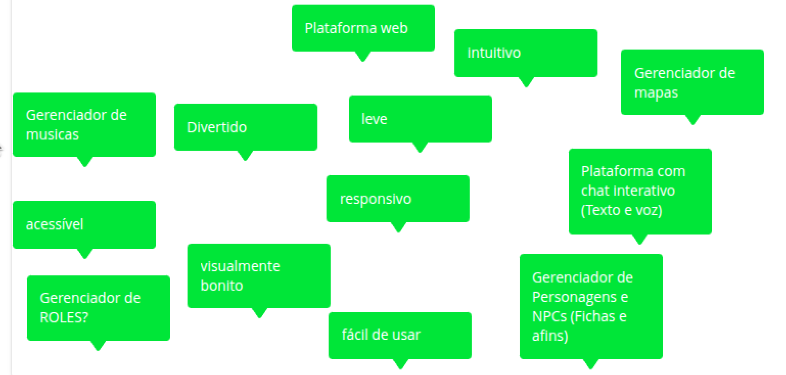
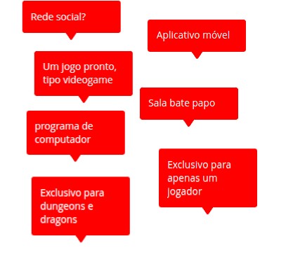
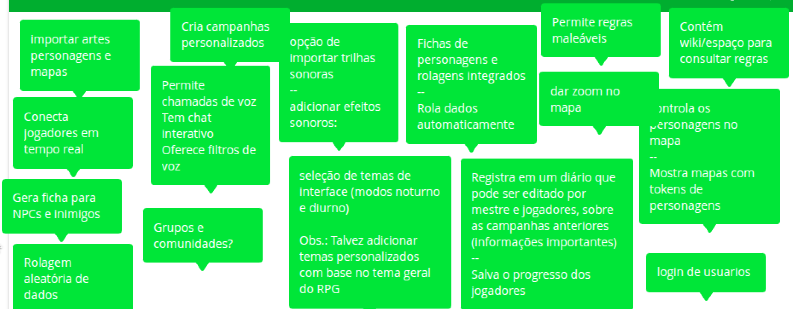
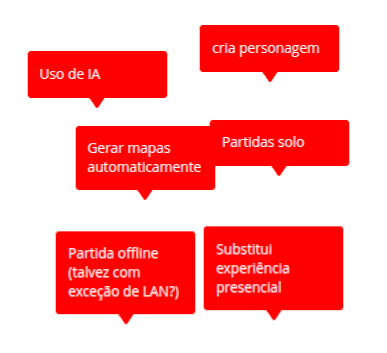

# Lean inception
Este documento resume os resultados obtidos ao final de cada etapa realizada do processo de Lean Inception

## O que é Lean Inception

É um método utilizado por metodologias ágeis para compreender e direcionar o projeto em seu estágio inicial. Ele auxilia no entedimento das principais funcinalidades que os clientes estimam para o produto, visando construir a definição do MVP (Produto Mínimo Viável).

O Lean Inception é dividido em algumas atividades, feitas em conjunto pela equipe, a fim de chegarem a um melhor entendimento do produto e decidir o MVP.

## Histórico de versões

| Data | Versão | Descrição | Autor(es) |
|------|--------|-----------|-----------|
| 21/04/2025 | 0.9 | Adição da primeira versão do documento | Matheus Pimentel Leal |

Na etapa de Lean Inception feita pelo grupo responsável de EPS e MDS do projeto EasyCrit, foi decidido pela realização em 4 etapas: Na primeira etapa ficou definido que o grupo definiria a visão do produto, a matriz "É - Não é - Faz - Não faz", a criação das personas e o começo do brainstorming de funcionalidades. Já na segunda etapa, as personas criadas passaram por um refinamento posterior, além da finalização da etapa de brainstorming de funcionalidades. A terceira etapa teve a responsabilidade de realizar a revisão e refinamento técnico de Experiência de usuário (UX) e negócio. E por fim, na quarta etapa foram montadas as jornadas de usuário além da conexão das funcionalidades com as jornadas e a construção do sequenciador e do Canvas MVP.

## Primeira etapa
### Visão do produto
**Para** jogar um RPG de mesa, **Cujo problema majoritário é** o controle do ambiente e dos jogadores do RPG, **O EasyCrit é** um ambiente virtual para jogar RPG em plataforma web, **que oferece** facilidade de acesso, maior gerenciamento e controle do jogo, **Diferentemente da** _Roll 20_, procura proporcionar facilidade de uso (UX). **O nosso produto busca** sincronizar e proporcionar melhor contole e apoio aos jogadores e mestres de RPG virtual.

### É - Não é - Faz - Não faz

O principal obejtivo dessa etapa, além de contribuir para o entedimento do produto é identificar os aspectos positivos e negativos do produto sobre o produto ser ou fazer algo. Para essa atividade os contribuintes separaram em quatro quadrantes o que entendem que o produto é, não é, faz e não faz. Assim, por meio desses quadrantes o grupo tem maior entendimento da categoria do produto e o que de fato espera-se que ele seja capaz de fazer e o que não deve fazer.

### **É**  
  

### **Não É**  
  

### **Faz**  
  

### **Não Faz**  
  

[Ver online no Slice](https://slice.wbrain.me/#/board/NvGwGTDRhgbNWl6hyT)

### Personas

Nesta etapa, toda a equipe colaborou para mapear os usuários potenciais do negócio. Criamos personas detalhadas — com papéis, características e necessidades, para guiar o desenvolvimento das funcionalidades do produto.

#### Persona 1 - Mestra RPG
|     foto         | **Descrição**                                                                |
|------------------|------------------------------------------------------------------------------|
| **Perfil**       |   |
| **Comportamento**|   |
| **Necessidades** |   |

#### Persona 2 - Jogadora
|      foto        | **Descrição**                                                                |
|------------------|------------------------------------------------------------------------------|
| **Perfil**       |   |
| **Comportamento**|   |
| **Necessidades** |   |
