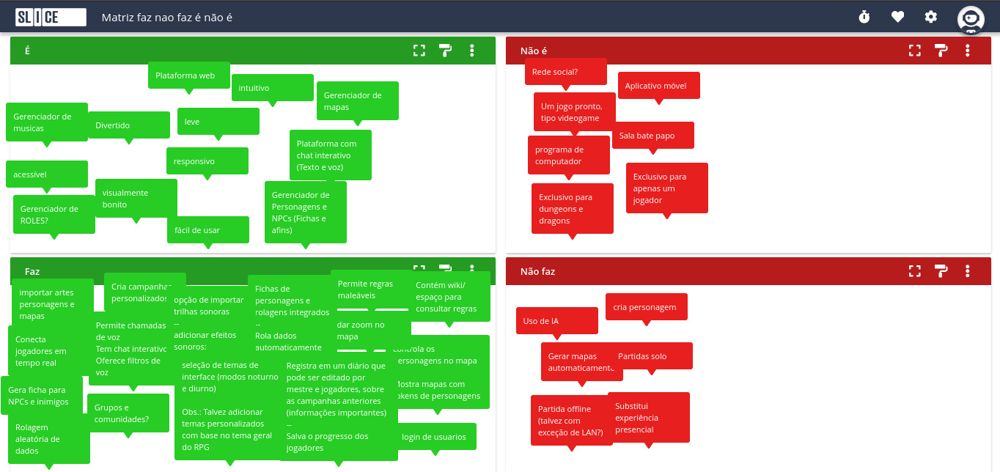
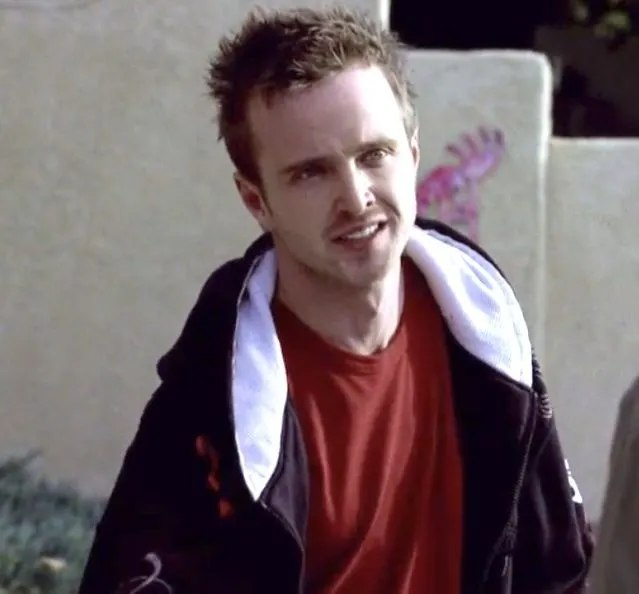
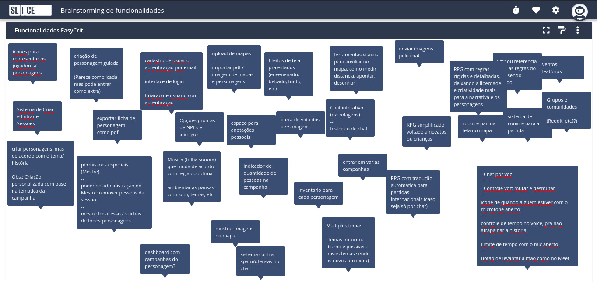
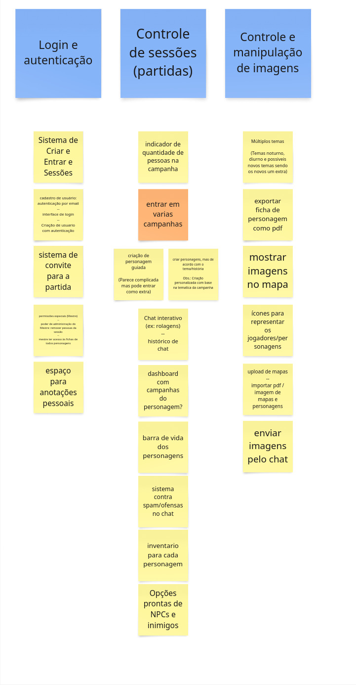
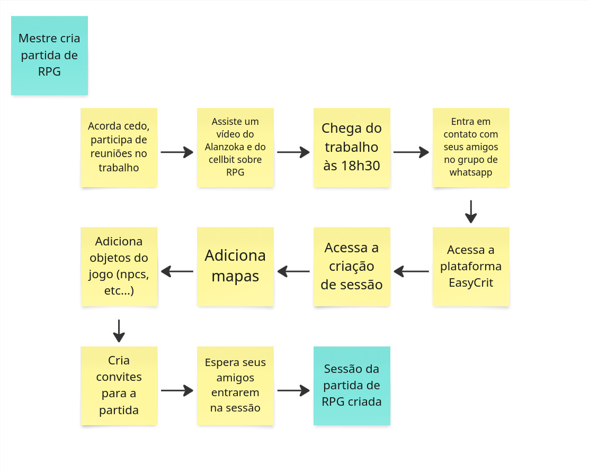
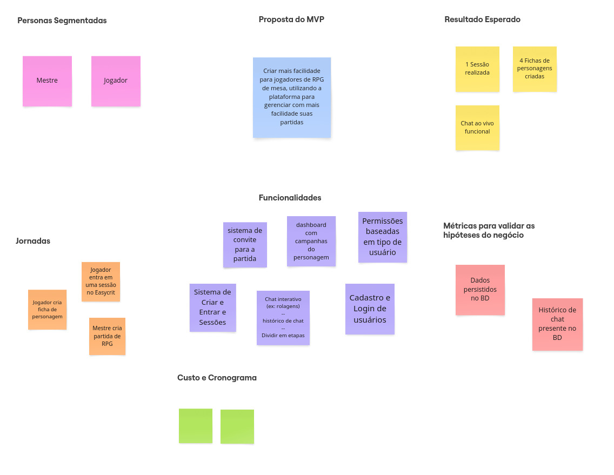

# Lean inception
Este documento resume os resultados obtidos ao final de cada etapa realizada do processo de Lean Inception

## O que é Lean Inception

É um método utilizado por metodologias ágeis para compreender e direcionar o projeto em seu estágio inicial. Ele auxilia no entedimento das principais funcinalidades que os clientes estimam para o produto, visando construir a definição do MVP (Produto Mínimo Viável).

O Lean Inception é dividido em algumas atividades, feitas em conjunto pela equipe, a fim de chegarem a um melhor entendimento do produto e decidir o MVP.

## Histórico de versões

| Data | Versão | Descrição | Autor(es) |
|------|--------|-----------|-----------|
| 21/04/2025 | 0.1 | Adição da primeira versão do documento | Matheus Pimentel Leal |
| 23/04/2025 | 0.2 | Adiciona Tópico de É, Não É, Faz, Não Faz | Philipe de Sousa Barros |
| 28/04/2025 | 0.3 | Adiciona segunda etapa do Lean Inception | Matheus Pimentel Leal |

## Siglas
| Sigla | Descrição |
|-------|-----------|
| MVP   | _Minimum Viable Product_ |
| EPS   | Engenharia do Produto de Software |
| MDS   | Métodos de Desenvolvimento de Software |
| UX    | _User Experience_ |
| RPG   | _Role Playing Game_ |

Na etapa de Lean Inception feita pelo grupo responsável de EPS e MDS do projeto EasyCrit, foi decidido pela realização em 4 etapas: Na primeira etapa ficou definido que o grupo definiria a visão do produto, a matriz "É - Não é - Faz - Não faz", a criação das personas e o começo do brainstorming de funcionalidades. Já na segunda etapa, as personas criadas passaram por um refinamento posterior, além da finalização da etapa de brainstorming de funcionalidades. A terceira etapa teve a responsabilidade de realizar a revisão e refinamento técnico de Experiência de usuário (UX) e negócio. E por fim, na quarta etapa foram montadas as jornadas de usuário além da conexão das funcionalidades com as jornadas e a construção do sequenciador e do Canvas MVP.

## Primeira etapa
### Visão do produto
**Para** jogar um RPG de mesa, **Cujo problema majoritário é** o controle do ambiente e dos jogadores do RPG, **O EasyCrit é** um ambiente virtual para jogar RPG em plataforma web, **que oferece** facilidade de acesso, maior gerenciamento e controle do jogo, **Diferentemente da** _Roll 20_, procura proporcionar facilidade de uso (UX). **O nosso produto busca** sincronizar e proporcionar melhor contole e apoio aos jogadores e mestres de RPG virtual.

### É - Não é - Faz - Não faz

O principal obejtivo dessa etapa, além de contribuir para o entedimento do produto é identificar os aspectos positivos e negativos do produto sobre o produto ser ou fazer algo. Para essa atividade os contribuintes separaram em quatro quadrantes o que entendem que o produto é, não é, faz e não faz. Assim, por meio desses quadrantes o grupo tem maior entendimento da categoria do produto e o que de fato espera-se que ele seja capaz de fazer e o que não deve fazer.

As categorias da matriz podem ser encontradas no [board da ferramentea slice da wBrain](https://slice.wbrain.me/#/board/NvGwGTDRhgbNWl6hyT) e na imagem abaixo

## Segunda etapa
### Personas

Nesta etapa, toda a equipe colaborou para mapear os usuários potenciais do negócio. Criamos personas detalhadas — com papéis, características e necessidades, para guiar o desenvolvimento das funcionalidades do produto.

#### Mestre de RPG

| Nome | McLovin |
|--------------|---------------|
| _foto_ | {width=100px} |
| _Ocupação_           | Engenheiro de Software  |
| _Dados demográficos_ | 34 anos, formado  |
| _Objetivos_          | organizar múltiplas campanhas mais facilmente; Testar ideias novas que não são viáveis ou práticas fisicamente; Pegar prática e experiência com RPGs; Gerenciar efeitos sonoros; Fazer livestreaming; jogar um pouco sem ter muito trabalho/ convencer amigos a jogar sem tanto trabalho; Controlar os eventos que acontecem dentro do jogo; Aprimorar a comunicação e criatividade;  |
| _Comportamento_      | Criativo, animado pra narrar, gosta de criar cenários para campanhas, leva a sério as ações dos jogadores; imersivo no jogo; criterioso com as regras; atento a detalhes; crítico a limitações da plataforma; conhecedor das regras do livro; grande ator de quinta categoria  |

#### Jogador de RPG
| Nome | Jesse |
|-----------------------------------------------------------|---------------|
| _foto_ | {width=100px} |
| _Ocupação_           | Desenvolvedor Júnior  |
| _Dados demográficos_ | 29 anos, Ensino superior incompleto  |
| _Objetivos_          | Ter um RPG para jogar enquanto não chega a próxima sessão da campanha presencial; Facilidade ao entrar no jogo; Gerenciar ficha do personagem que interpreta; Passar o tempo; Ter um motivo para interagir com os amigos periodicamente; Aprender a jogar/experimentar; Interagir com o mundo criado pelo mestre  |
| _Comportamento_      | síndrome de protagonista (interrompe o mestre toda hora), demora demais nos turnos, personagem genérico, quita no meio da sessão/campanha; agressivo com os NPCs; Não sabe o que está jogando, faz suspense ao jogar um d20, nunca terminou a ficha, finaliza o passado do personagem na ultima sessão; Tenta vencer mais que se divertir  |

### Brainstorming de funcionalidades

Na etapa de brainstorming de funcionalidades foi utilizada a ferramente slice da wBrain, que fazer a criação, organização e manejo de boards. Essa etapa foi realizada em 2 dias, para que fossem coletadas a maior quantidade de ideias sem refino. O resultado do brainstorming pode ser encontrado na imagem abaixo e no [board do slice](https://slice.wbrain.me/#/board/TjoFKDzPfvTOI6TTQu)

### Revisão técnica

Após o brainstorming, é necessário realizar a revisão técnica das funcionalidades levantadas para levar em consideração o que é possível com base na capacidade da equipe e também o que era fora do alcance para o tempo de desenvolvimento disponível. Com isso, chegamos à seguinte lista de funcionalidades:

Os cards azuis representam épicos, e o único card laranja representa um requisito não funcional do sistema, mas que também pode representar a funcionalidade "entrar em campanha"

### Jornadas de usuários
Foram criadas **três** jornadas de usuário, uma com base na persona do Mestre de RPG e duas com base na persona do jogador de RPG. Elas podem ser encontradas nas imagens abaixo:

**Jornada 1**

**Jornada 2**

**Jornada 3**

### Sequenciador
Em construção

### Canvas MVP
O canvas MVP do projeto EasyCrit traz uma representação visual do MVP do projeto, passando pelas funcionalidades levantadas, as personas envolvidas, as jornadas de usuário contempladas, qual o resultado esperado com a disponibilização do projeto em estado de MVP e quais métricas serão utilizadas. Além de trazer uma visão do custo para realizar o desenvolvimento e o cronograma de desenvolvimento a ser seguido. O artefato pode ser visto na imagem abaixo:

