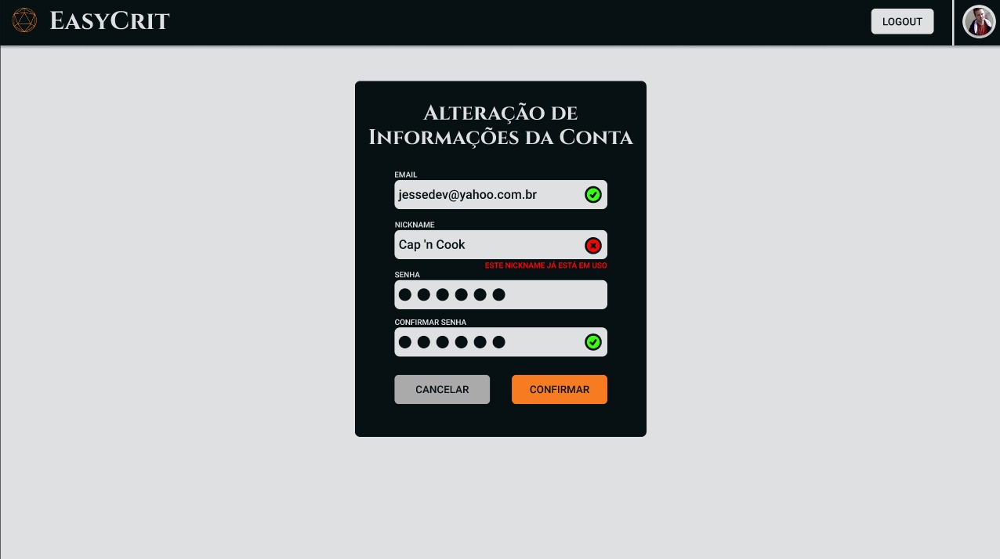

# Prototipagem

**Histórico de Versão**

| Data | Versão | Descrição | Autor(es) |
|------|--------|-----------|-----------|
| 16/05/2025 | 0.1 | Adição da primeira versão do documento | Pedro H. Pereira |
| 16/05/2025 | 0.2 |  Adição de imagens e detalhes| Lara Souza |

# Protótipo em Baixa Fidelidade

A prototipagem das telas visuais do “EasyCrit” foi feita a partir de modelos de baixa fidelidade, contemplando todas as funcionalidades planejadas. Nessa fase, implementamos recursos básicos — como login, registro, edição de perfil e tela inicial — e também funcionalidades exclusivas, tais como perfis de mestre e jogador, salas de RPG, chat interativo, criação e entrada de campanhas, além de edição de personagens. Elementos esses essenciais para o funcionamento do MVP (Minimum Viable Product).

## Telas

#  Protótipo de Alta Fidelidade

Após finalizar o modelo de baixa fidelidade, com todas as funcionalidades originais, refinando aspectos estéticos — tipografia, paleta de cores e fluxos de navegação — e incorporando interações mais realistas, implementamos nossa versão de alta fidelidade do protótipo com auxílio da ferramenta Figma. Clique no link abaixo para testa-lo: [Protótipo de alta fidelidade](https://www.figma.com/proto/iVipSzEzRnHX7Mre3oCAdw/High-Fidelity-Interactive-Prototype---MDS?node-id=1-92&t=7ASk4bFTbNpMcqNt-1)

## Login do Usuário

## Cadastro do Usuário

## Alterações de Informações na Conta

## Dashboard do Mestre

## Dashboard do Jogador

## Criação de Campanha

## Criação de Personagem

## Sessão

