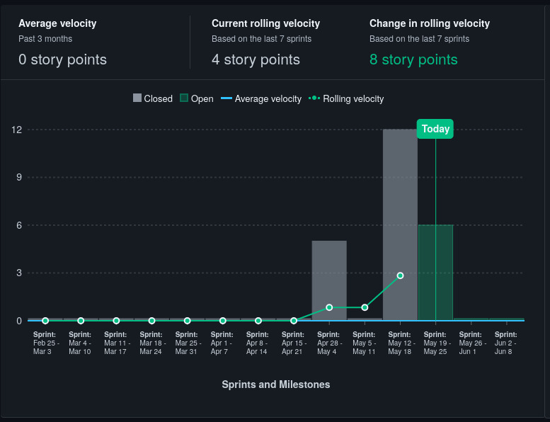
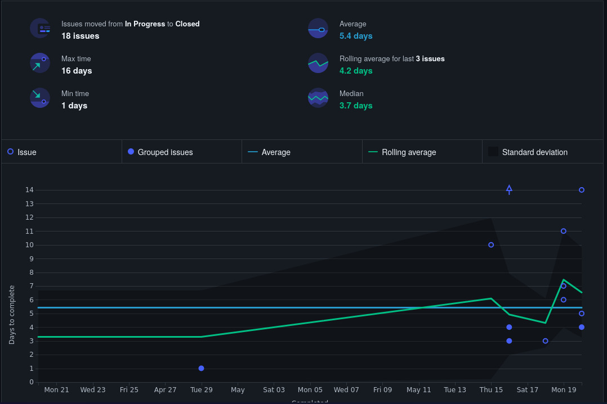

# 📝 Revisão da Release v0.1 - R1

## 📅 Data da Release
`20/05/2025`

---

## 🎯 Objetivos da Release

- Criação das pipelines de CI
- Configuração do projeto
- Criação dos protótipos frontend
- Criação da página de login
- Cadastro, remoção, leitura e atualização de dados de usuários

---

## ✅ O que foi entregue?

- ✅ Pipelines de CI
- ✅ Documentação de pré projeto
- ✅ Protótipos frontend
- ✅ Rotas de CRUD de usuários
- ✅ Tela de login
- ✅ Gerenciamento de riscos
- ✅ Arquitetura do projeto

## 📊 Métricas (se aplicável)

### Velocity

### Burn Up

### Bottleneck

### Lead time

---

## 💡 Lições Aprendidas
 
- 👍 O processo de CI/CD funcionou sem falhas
- 👎 Planejamento da sprint precisa melhorar estimativas
- 👏 Comunicação entre áreas foi eficiente

---

## ⚠️ Desafios Encontrados

- Mudança de professores atrasou o planejamento
- Falta de conhecimento sobre as ferramentas
- Planejamento tardio

---

## 🛠️ Melhorias para as próximas Releases

- Realização de mais dojos
- Refinar melhor as tarefas no backlog
- Estabeles melhores critérios de aceitação de tasks
- Melhorar o planejamento das sprints
- Apoiar mais o desenvolvimento

---

## 📚 Referências

- [Changelog da versão](https://github.com/fga-eps-mds/2025.1-EasyCrit-docs/releases/tag/v0.1)
- [Board do projeto](https://app.zenhub.com/workspaces/easycrit---rpg-virtual-61fbf381b1fbfb00106daf65/board)

