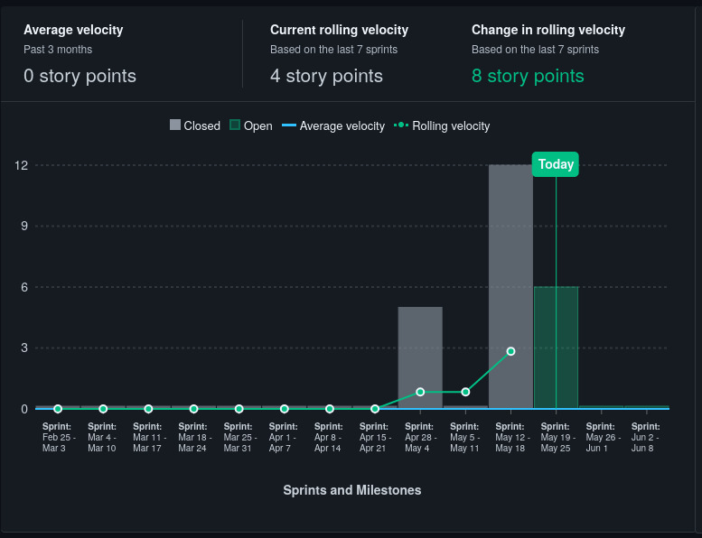
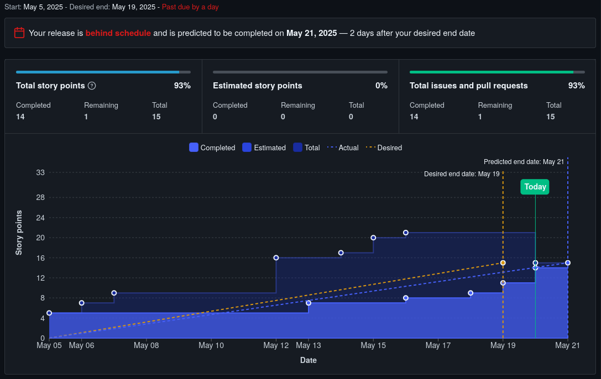
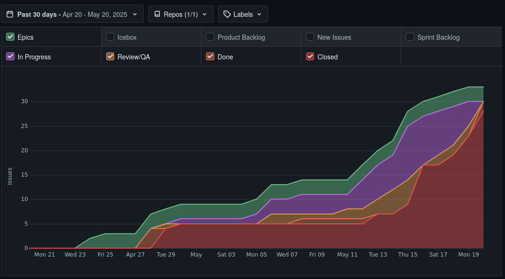
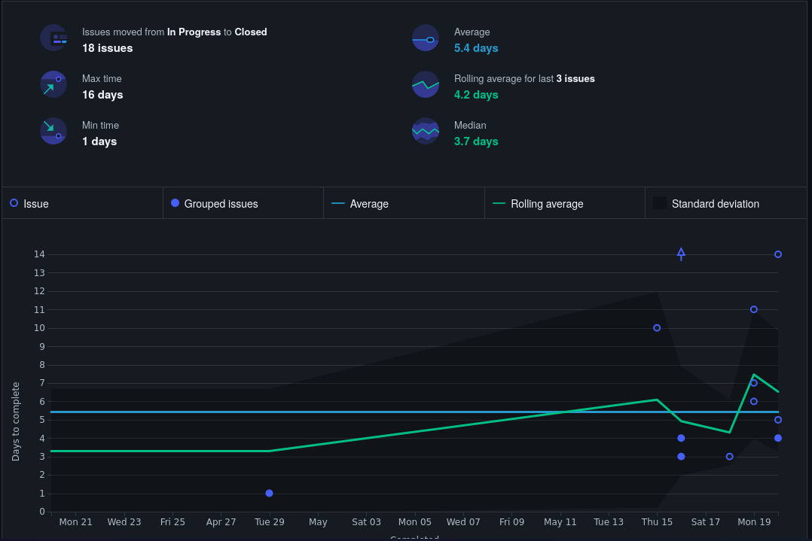

# 📝 Revisão da Release v0.5 - RN

## 📅 Data da Release
`15/07/2025`

---

## 🎯 Objetivos da Release

- API de autenticação
- API de controle de sessões
- Modelagem do banco de dados
- Diagrama de classes do sistema
- Testes integrados às APIs
- Criação de websockets na API session
- Conexão de sessões no frontend usando websockets

---

## ✅ O que foi entregue?

- ✅ CI completo com pipelines de testes e qualidade de código
- ✅ API de autenticação
- ✅ Frontend login, cadastro e dashboards
- ✅ Testes acima de 70% na API de controle de sessões
- ✅ Criação das conexões websocket via API de controle de sessões
- ✅ Documentação de gerenciamento de riscos 

## 📊 Métricas (se aplicável)

### Velocity

### Burn Up

### Bottleneck

### Lead time

---

## 💡 Lições Aprendidas
 
- 👍 Comunicação foi um fator muito importante durante o desenvolvimento do projeto
- 👎 Muitas mudanças na definição das sprints, Baixa atuação de membros cruciais do projeto e falha ao gerenciar os riscos foram fatores determinantes para a falta da entrega do MVP
- 👏 Muito aprendizado sobre Engenharia de Software pode ser obtido, passando por todas as áreas pertinentes ao desenvolvimento de um produto de software.

---

## ⚠️ Desafios Encontrados

- Falra de presença de dois membros de EPS prejudicou muito o andamento do projeto
- Falta de rapidez na revisão e aceitação dos Pull Requests
- Falta de conhecimento sobre as ferramentas
- Muitas mudanças na forma de distribuição de tarefas prejudicaram o desenvolvimento

---

## 🛠️ Melhorias para as próximas Releases

- Realização de mais dojos
- Melhorar a definição de tarefas
- Criação de tarefas mais atômicas, para melhor gerenciamento do andamento do projeto e da distribuição das tarefas.
- Comprometimento com o projeto por parte dos membros ausentes de EPS
- Apoiar mais o desenvolvimento dos membros de MDS

---

## 📚 Referências

- [Changelog da versão](https://github.com/fga-eps-mds/2025.1-EasyCrit-docs/releases/tag/v0.1)
- [Board do projeto](https://app.zenhub.com/workspaces/easycrit---rpg-virtual-61fbf381b1fbfb00106daf65/board)

