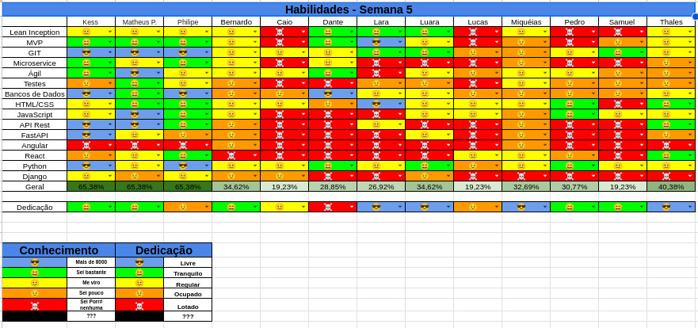

## Histórico de Revisão
| Data         | Versão | Modificação                                  | Autor(a)                |
| ------------ | ------ | -------------------------------------------- | ----------------------- |
| _26/05/2025_ | _0.1_  | _criação do documento de review da sprint 4_ | _Matheus Pimentel Leal_ |

# Review Sprint _4_
- _Revisão geral de como foi a sprint anterior._

## Tasks
| ID    | Descrição                                    |
| ----- | -------------------------------------------- |
| _#31_ | _Configuração da autenticação por token JWT_ |
| _#66_ | _Refatoração da tela de login_               |
| _#28_ | _Criação da tela de cadastro_                |
| _#30_ | _Rota de autenticação de usuários_           |
| _#68_ | _Redesign do protótipo de alta fidelidade_   |

## Sub-tasks
N/A

### Dívidas Alocadas
| ID    | Descrição                                    |
| ----- | -------------------------------------------- |
| _#31_ | _Configuração da autenticação por token JWT_ |
| _#30_ | _Rota de autenticação de usuários_           |
| _#68_ | _Redesign do protótipo de alta fidelidade_   |

## Qualidade do Trabalho Entregue
Trabalho entregue com boa qualidade em relação ao conhecimento prévio do grupo
## Retrospectiva
[//]:<> (Adicionar) 
### Pontos Positivos
- Descrições nas issues com maior detalhe e clareza
- Guias presentes na wiki ajudaram muito na hora de realizar commits e pull requests
- Utilização do live share do vscode ajudou muito a realizar pair programming
- Comunicação continua clara e objetiva, evitando mal entendidos

### Pontos Negativos
- Tasks relacionadas acabaram por "confundir" na realização de tasks (refatoração do prototipo de alta e criação da tela de cadastro / login)
- Configuração de ambientes (docker no windows)
- Um membro realizou a task de outro sem querer

### Pontos de Melhoria
- Melhorar apresentação das releases (Padrão de apresentação para ser mais profissional)
- Separar em grupos com horários compatíveis para fazer pair programming nas tasks
- Criar testes unitários backend

# Planning da Sprint _5_
- **Período:** _26/05/25 a 02/06/25_
- **Objetivo:** _Criação dos testes unitários, configuração websocket, refatoração arquitetura, validação dos schemas backend_

## Tasks alocadas
| ID    | Descrição                                                    | Assignees             |
| ----- | ------------------------------------------------------------ | --------------------- |
| _#31_ | _Configuração da autenticação por token JWT_                 | **Thales e Caio**     |
| _#30_ | _Rota de autenticação de usuários_                           | **Caio e Thales**     |
| _#68_ | _Redesign do protótipo de alta fidelidade_                   | **Lucas e Miqueias**  |
| _#70_ | _Criar testes unitários de CRUD de usuários backend_         | **Dante e Lucas**     |
| _#39_ | _Conexão websocket com o servidor_                           | **Luara e Wata**      |
| _#69_ | _Integração frontend e backend (Página de login e cadastro)_ | **Lara e Pedro**      |
| _#32_ | _Tela dashbaord do mestre_                                   | **Miqueias e Samuel** |
| _#33_ | _Tela dashboard do jogador_                                  | **Miqueias e Samuel** |
| _#66_ | _Refatoração da tela de login_                               | **Luara e Lara**      |

## Possíveis Riscos Mapeados para a Sprint 5
- Provas na semana
- Gerenciamento de tempo
- Membros terem problemas de saúde

# Quadro de Conhecimento
[//]: <> (Anexar aqui o quadro de conhecimento atualizado e remover o comentário)

