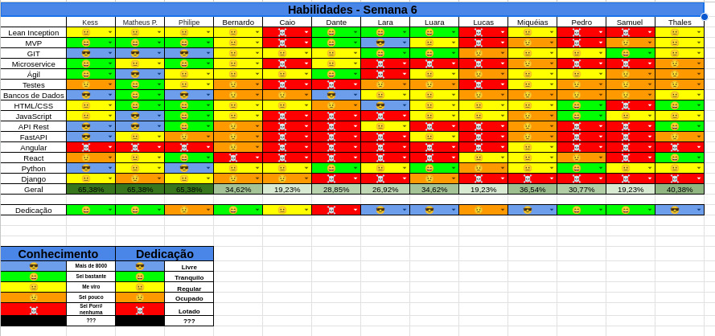

## Histórico de Revisão
| Data         | Versão | Modificação                                  | Autor(a)                |
| ------------ | ------ | -------------------------------------------- | ----------------------- |
| _02/06/2025_ | _0.1_  | _criação do documento de review da sprint 5_ | _Matheus Pimentel Leal_ |

# Review Sprint _5_
- _Revisão geral de como foi a sprint anterior._

## Tasks
| ID    | Descrição                                                    | Assignees             |
| ----- | ------------------------------------------------------------ | --------------------- |
| _#31_ | _Configuração da autenticação por token JWT_                 | **Thales e Caio**     |
| _#30_ | _Rota de autenticação de usuários_                           | **Caio e Thales**     |
| _#68_ | _Redesign do protótipo de alta fidelidade_                   | **Lucas e Miqueias**  |
| _#70_ | _Criar testes unitários de CRUD de usuários backend_         | **Dante e Lucas**     |
| _#39_ | _Conexão websocket com o servidor_                           | **Luara e Wata**      |
| _#69_ | _Integração frontend e backend (Página de login e cadastro)_ | **Lara e Pedro**      |
| _#32_ | _Tela dashbaord do mestre_                                   | **Miqueias e Samuel** |
| _#33_ | _Tela dashboard do jogador_                                  | **Miqueias e Samuel** |
| _#66_ | _Refatoração da tela de login_                               | **Luara e Lara**      |
| _#28_ | _Criação da tela de cadastro_                                | **Wata e Pedro**      |

## Qualidade do Trabalho Entregue
Nenhum trabalho foi entregue por falha na fluxo de review dos PRs, caso os PRs tivessem sido revisados, teríamos entregue 60% do trabalho.
## Retrospectiva
[//]:<> (Adicionar) 
### Pontos Positivos
- Boa comunicação dos membros de MDS com EPS
- Material disponibilizado para estudo dos websockets

### Pontos Negativos
- Review dos PRs demorando **muito** para acontecer
- Nenhuma task de EPS foi priorizada / concluída na sprint passada por falta de planejamento dos membros de EPS

### Pontos de Melhoria
- Melhorar a divisão dos reviews
- Dedicar mais tempo para as tasks

# Planning da Sprint _6_
- **Período:** _02/06/25 a 09/06/25_
- **Objetivo:** Finalização das tasks da sprint passada, revisão das tasks concluídas, implementação do websocket e realização das correções de EPS.

## Tasks alocadas
| ID    | Descrição                                                    | Assignees             |
| ----- | ------------------------------------------------------------ | --------------------- |
| _#31_ | _Configuração da autenticação por token JWT_                 | **Thales e Caio**     |
| _#30_ | _Rota de autenticação de usuários_                           | **Caio e Thales**     |
| _#68_ | _Redesign do protótipo de alta fidelidade_                   | **Lucas e Miqueias**  |
| _#70_ | _Criar testes unitários de CRUD de usuários backend_         | **Dante e Lucas**     |
| _#39_ | _Conexão websocket com o servidor_                           | **Luara e Wata**      |
| _#69_ | _Integração frontend e backend (Página de login e cadastro)_ | **Lara e Pedro**      |
| _#32_ | _Tela dashbaord do mestre_                                   | **Miqueias e Samuel** |
| _#33_ | _Tela dashboard do jogador_                                  | **Miqueias e Samuel** |
| _#66_ | _Refatoração da tela de login_                               | **Luara e Lara**      |
| _#28_ | _Criação da tela de cadastro_                                | **Wata e Pedro**      |

## Possíveis Riscos Mapeados para a Sprint 6
- Provas na semana
- Gerenciamento de tempo
- Membros terem problemas de saúde
- Demora pra finalização dos reviews
- Demora pra realização das correções de EPS

# Quadro de Conhecimento
[//]: <> (Anexar aqui o quadro de conhecimento atualizado e remover o comentário)

