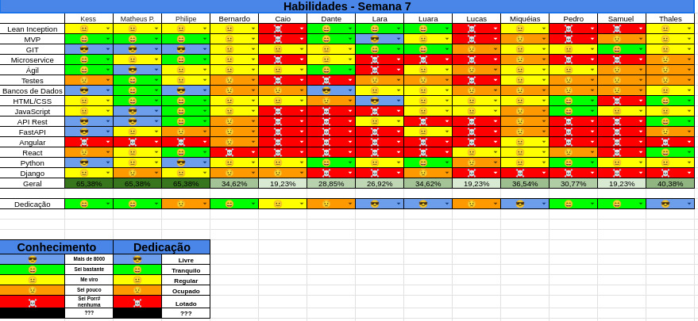

## Histórico de Revisão
| Data         | Versão | Modificação                                  | Autor(a)                |
| ------------ | ------ | -------------------------------------------- | ----------------------- |
| _10/06/2025_ | _0.1_  | _criação do documento de review da sprint 5_ | _Matheus Pimentel Leal_ |

## Membros presentes
| Nome                  | Equipe | Presente? |
| --------------------- | ------ | --------- |
| Matheus Pimentel Leal | EPS    | ✅         |
| Kess Jones            | EPS    | ❌         |
| Philipe               | EPS    | ❌         |
| Bernardo (wata)       | MDS    | ✅         |
| Caio                  | MDS    | ❌         |
| Dante                 | MDS    | ❌         |
| Lara                  | MDS    | ✅         |
| Luara                 | MDS    | ✅         |
| Lucas de Paula        | MDS    | ✅         |
| Miqueias              | MDS    | ✅         |
| Pedro                 | MDS    | ✅         |
| Samuel                | MDS    | ❌         |
| Thales Duarte         | MDS    | ✅         |

# Review Sprint _6_
- _Revisão geral de como foi a sprint anterior._

## Tasks
| ID    | Descrição                                                    | Assignees             | Finalizada |
| ----- | ------------------------------------------------------------ | --------------------- | ---------- |
| _#31_ | _Configuração da autenticação por token JWT_                 | **Thales e Caio**     | ✅          |
| _#30_ | _Rota de autenticação de usuários_                           | **Caio e Thales**     | ⚠️         |
| _#68_ | _Redesign do protótipo de alta fidelidade_                   | **Lucas e Miqueias**  | ⚠️         |
| _#70_ | _Criar testes unitários de CRUD de usuários backend_         | **Dante e Lucas**     | ❌          |
| _#39_ | _Conexão websocket com o servidor_                           | **Luara e Wata**      | ⚠️         |
| _#69_ | _Integração frontend e backend (Página de login e cadastro)_ | **Lara e Pedro**      | ⚠️         |
| _#32_ | _Tela dashbaord do mestre_                                   | **Miqueias e Samuel** | ⚠️         |
| _#33_ | _Tela dashboard do jogador_                                  | **Miqueias e Samuel** | ⚠️         |
| _#66_ | _Refatoração da tela de login_                               | **Luara e Lara**      | ✅          |
| _#28_ | _Criação da tela de cadastro_                                | **Wata e Pedro**      | ⚠️         |

!!! note "Legenda" 
    - ✅ Concluida
    - ⚠️ Impedida / Em code Review
    - ❌ Nao finalizada

## Qualidade do Trabalho Entregue
O pouco trabalho que foi de fato entregue teve boa qualidade, contando com testes unitarios no desenvolvimento backend e com os padroes estabelecidos no projeto frontend.
## Retrospectiva
### Pontos Positivos
- Material disponibilizado ajudou no desenvolvimento
- Comunicacao para dependencia de tasks foi relativamente boa, o que deixou as espectativas sobre conclusao de tasks mais realista
- Disposicao de EPS para ajudar, devemos apenas driblar os empecilhos de tempo
- Disposicao de MDS para desenvolver continua boa, devemos apenas driblar os empecilhos de tempo
### Pontos Negativos
- Muitas tasks foram iniciadas, mas poucas foram finalizadas.
- Relacao de entrega / inicio de tasks esta baixa
### Pontos de Melhoria
- Comunicacao sobre finalizacao de tasks / code reviews deve melhorar
- Finalizacao das tasks prioritarias deve ter mais urgencia para mitigar os danos causados pela demora de entrega
# Planning da Sprint _7_
- **Período:** _09/06/25 a 16/06/25_
- **Objetivo:** Finalização das tasks da sprint passada, revisão das tasks concluídas, implementação do websocket e realização das correções de EPS.

## Tasks alocadas
| ID    | Descrição                                                    | Assignees             |
| ----- | ------------------------------------------------------------ | --------------------- |
| _#30_ | _Rota de autenticação de usuários_                           | **Caio e Thales**     |
| _#68_ | _Redesign do protótipo de alta fidelidade_                   | **Lucas e Miqueias**  |
| _#70_ | _Criar testes unitários de CRUD de usuários backend_         | **Dante e Lucas**     |
| _#39_ | _Conexão websocket com o servidor_                           | **Luara e Wata**      |
| _#69_ | _Integração frontend e backend (Página de login e cadastro)_ | **Lara e Pedro**      |
| _#32_ | _Tela dashbaord do mestre_                                   | **Miqueias e Samuel** |
| _#33_ | _Tela dashboard do jogador_                                  | **Miqueias e Samuel** |
| _#28_ | _Criação da tela de cadastro_                                | **Wata e Pedro**      |

!!! note "Combinados para esta sprint"
    - Assim que os PRs forem abertos, informar a todos no grupo
    - Ajudar mais o pessoal de MDS
    - Assim que os code reviews forem concluidos, informar a todos no grupo

## Possíveis Riscos Mapeados para a Sprint 7
- Provas na semana
- Gerenciamento de tempo
- Membros terem problemas de saúde
- Demora pra finalização dos reviews
- Demora pra realização das correções de EPS

# Quadro de Conhecimento

[//]: <> (Anexar aqui o quadro de conhecimento atualizado e remover o comentário)

