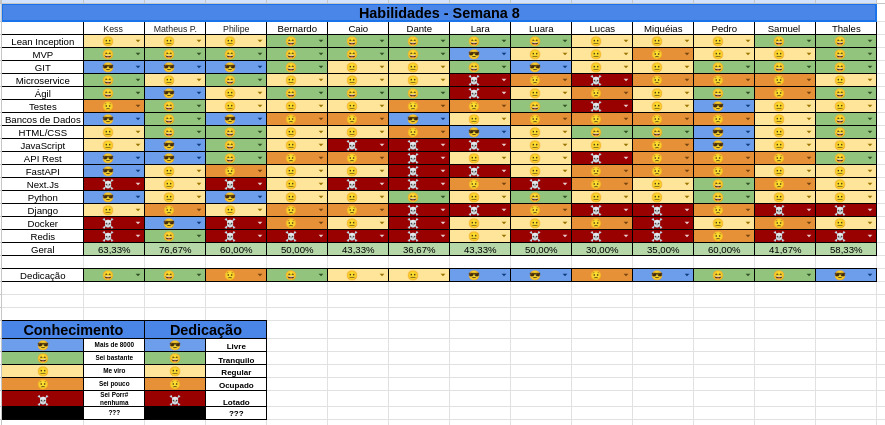

## Histórico de Revisão
| Data         | Versão | Modificação                                  | Autor(a)                |
| ------------ | ------ | -------------------------------------------- | ----------------------- |
| _16/06/2025_ | _0.1_  | _criação do documento de review da sprint 7_ | _Matheus Pimentel Leal_ |

## Membros presentes
| Nome                  | Equipe | Presente? | Justificativa ?                 |
| --------------------- | ------ | --------- | ------------------------------- |
| Matheus Pimentel Leal | EPS    | ✅         |                                 |
| Kess Jones            | EPS    | ❌         |                                 |
| Philipe               | EPS    | ❌         |                                 |
| Bernardo (wata)       | MDS    | ✅         |                                 |
| Caio                  | MDS    | ✅         |                                 |
| Dante                 | MDS    | ✅         |                                 |
| Lara                  | MDS    | ✅         |                                 |
| Luara                 | MDS    | ✅         |                                 |
| Lucas de Paula        | MDS    | ✅         |                                 |
| Miqueias              | MDS    | ❌         | Compromisso previamente marcado |
| Pedro                 | MDS    | ✅         |                                 |
| Samuel                | MDS    | ✅         |                                 |
| Thales Duarte         | MDS    | ✅         |                                 |

# Review Sprint _7_
- _Revisão geral de como foi a sprint anterior._

## Tasks
| ID    | Descrição                                                         | Assignees             | Finalizada |
| ----- | ----------------------------------------------------------------- | --------------------- | ---------- |
| _#30_ | _Rota de autenticação de usuários_                                | **Caio e Thales**     | ✅          |
| _#68_ | _Redesign do protótipo de alta fidelidade_                        | **Lucas e Miqueias**  | ✅          |
| _#70_ | _Criar testes unitários de CRUD de usuários backend_              | **Dante e Lucas**     | ⚠️❌        |
| _#39_ | _Conexão websocket com o servidor_                                | **Luara e Wata**      | ⚠️         |
| _#69_ | _Integração frontend e backend (Página de login e cadastro)_      | **Lara e Pedro**      | ⚠️         |
| _#32_ | _Tela dashbaord do mestre_                                        | **Miqueias e Samuel** | ⚠️         |
| _#33_ | _Tela dashboard do jogador_                                       | **Miqueias e Samuel** | ⚠️         |
| _#28_ | _Criação da tela de cadastro_                                     | **Wata e Pedro**      | ✅⚠️        |
| _#66_ | _Refatoração da tela de login_                                    | **Luara e Lara**      | ✅          |
| _#74_ | _Criação do Diagrama Entidade-Relacionamento dos bancos de dados_ | **Matheus**           | ❌          |
| _#73_ | _Criação do diagrama de classes_                                  | **Matheus**           | ❌          |
| _#71_ | _Mudança de arquitetura / containerização_                        | **Matheus**           | ✅⚠️        |
| _#72_ | _Melhoria do diagrama do system design_                           | **Matheus**           | ✅⚠️        |

!!! note "Legenda"
    - ✅ Concluida
    - ⚠️ Impedida / Em code Review
    - ❌ Nao finalizada

## Qualidade do Trabalho Entregue
Em geral, a qualidade foi boa devido ao tempo disponivel nesta semana para o desenvolvimento. O ponto principal de atencao sera a pipeline de Review/QA. tendo em vista  muitas tasks paradas nesta etapa.

## Retrospectiva
### Pontos Positivos
- Por conta da demora na revisao dos PRs, o tempo de desenvolvimento foi extendido.
- Aprendizado sobre os conceitos desenvolvidos foi notorio.
- As aulas foram curtas, o que possibilitou a ida mais cedo para casa, o que facilitou a organizacao do tempo de desenvolvimento.
- 
### Pontos Negativos
- Demora na revisao de PRs e ajuda de MDS por parte de EPS.
- Feedbacks em relacao a EPS fica centralizado no Matheus, o que dificulta no desenvolvimento.
- Oferecimento de ajudas por parte dos membros de EPS esta baixo. deve-se ser mais proativo em relacao a isto.
- 
### Pontos de Melhoria
- Melhorar planejamento dos membros de EPS para code reviews / ajuda.
- Oferecer mais ajuda, e ajuda mais diversificada, por mais membros de EPS
- 
# Planning da Sprint _8_
- **Período:** _16/06/25 a 23/06/25_
- **Objetivo:** Finalização das tasks da sprint passada, revisão das tasks concluídas, implementação do websocket e realização das correções de EPS.

## Tasks alocadas
| ID    | Descrição                                                         | Assignees            |
| ----- | ----------------------------------------------------------------- | -------------------- |
| _#34_ | _Rota de criação de campanhas_                                    | **Pedro e Caio**     |
| _#77_ | _Tela de criacao de campanha_                                     | **Samuel e Thales**  |
| _#36_ | _Tela de criação de personagens_                                  | **Lucas e Lara**     |
| _#35_ | _Rota de criação de personagens_                                  | **Dante e Wata**     |
| _#49_ | _criar convite de sessão de jogo_                                 | **Luara e Miqueias** |
| _#74_ | _Criação do Diagrama Entidade-Relacionamento dos bancos de dados_ | **Matheus**          |
| _#73_ | _Criação do diagrama de classes_                                  | **Matheus**          |
| _#70_ | _Criar testes unitários de CRUD de usuários backend_              | **Dante e Lucas**    |

!!! note "Combinados para esta sprint"
    - Assim que os PRs forem abertos, informar a todos no grupo
    - Ajudar mais o pessoal de MDS
    - Assim que os code reviews forem concluidos, informar a todos no grupo

## Possíveis Riscos Mapeados para a Sprint 8
- Provas na semana
- Gerenciamento de tempo
- Membros terem problemas de saúde
- Demora pra finalização dos reviews
- Demora pra realização das correções de EPS

# Quadro de Conhecimento

[//]: <> (Anexar aqui o quadro de conhecimento atualizado e remover o comentário)

