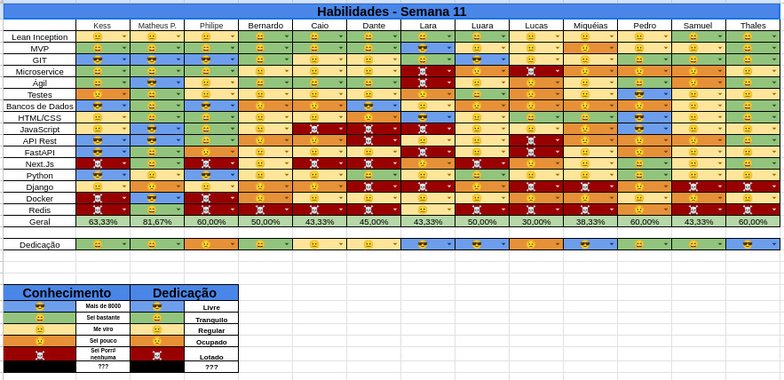

## Histórico de Revisão
| Data         | Versão | Modificação                                  | Autor(a)                |
| ------------ | ------ | -------------------------------------------- | ----------------------- |
| _30/06/2025_ | _0.1_  | _criação do documento de review da sprint 9_ | _Matheus Pimentel Leal_ |

## Membros presentes
| Nome                  | Equipe | Presente? | Justificativa ?    |
| --------------------- | ------ | --------- | ------------------ |
| Matheus Pimentel Leal | EPS    | ✅         |                    |
| Kess Jones            | EPS    | ❌         |                    |
| Philipe               | EPS    | ✅         |                    |
| Bernardo (wata)       | MDS    | ❌         |                    |
| Caio                  | MDS    | ❌         |                    |
| Dante                 | MDS    | ✅         |                    |
| Lara                  | MDS    | ✅         |                    |
| Luara                 | MDS    | ✅         |                    |
| Lucas de Paula        | MDS    | ❌         | compromisso previo |
| Miqueias              | MDS    | ✅         |                    |
| Pedro                 | MDS    | ✅         |                    |
| Samuel                | MDS    | ✅         |                    |
| Thales Duarte         | MDS    | ✅         |                    |

# Review Sprint _10_
- _Revisão geral de como foi a sprint anterior._

## Tasks
| ID    | Descrição                                                         | Assignees             | Finalizada |
| ----- | ----------------------------------------------------------------- | --------------------- | ---------- |
| _#70_ | _Criar testes unitários de CRUD de usuários backend_              | **Dante e Lucas**     | ✅⚠️        |
| _#39_ | _Conexão websocket com o servidor_                                | **Luara e Wata**      | ✅⚠️        |
| _#69_ | _Integração frontend e backend (Página de login e cadastro)_      | **Lara e Pedro**      | ✅⚠️        |
| _#32_ | _Tela dashbaord do mestre_                                        | **Miqueias e Samuel** | ✅⚠️        |
| _#33_ | _Tela dashboard do jogador_                                       | **Miqueias e Samuel** | ✅⚠️        |
| _#74_ | _Criação do Diagrama Entidade-Relacionamento dos bancos de dados_ | **Matheus**           | ❌          |
| _#73_ | _Criação do diagrama de classes_                                  | **Matheus**           | ❌          |
| _#72_ | _Melhoria do diagrama do system design_                           | **Matheus**           | ✅          |
| _#34_ | _Rota de criação de campanhas_                                    | **Pedro e Caio**      | ⚠️❌        |
| _#77_ | _Tela de criacao de campanha_                                     | **Samuel e Thales**   | ✅⚠️        |
| _#36_ | _Tela de criação de personagens_                                  | **Lucas e Lara**      | ⚠️❌        |
| _#35_ | _Rota de criação de personagens_                                  | **Dante e Wata**      | ❌          |
| _#49_ | _criar convite de sessão de jogo_                                 | **Luara e Miqueias**  | ✅⚠️        |
| _#71_ | _Mudança de arquitetura / containerização_                        | **Matheus**           | ✅          |

!!! note "Legenda"
    - ✅ Concluida
    - ⚠️ Impedida / Em code Review
    - ❌ Nao finalizada

## Qualidade do Trabalho Entregue
- Qualidade do trabalho se manteve, mas com a demora na revisao e correcao dos PRs, a analise da qualidade de codigo ficou comprometida.

## Retrospectiva
### Pontos Positivos
- Conhecimento dos membros melhorou devido ao tempo de projeto
- A mudanca da arquitetura ficou mais estavel o que fez com que os membros pudesse, ter mais confianca ao rodar o projeto
- Rapidez na ajuda aos membros de MDS aumentou um pouco
- 
### Pontos Negativos
- Grande demora nos reviews esta prejudicando a finalizacao do projeto
- Colocar pessoas que mexeram mais em uma stack para mexer com a outra (quem mexeu no front agora para o back e vice versa) neste ponto final do projeto dificulta a velocidade de entrega
- Final do semestre complica o tempo de dedicacao a materia, o que dificulta a priorizacao das tarefas
- Muitas provas e trabalhos chegando o que faz com que a materia seja prejudicada
- 
### Pontos de Melhoria
- Aumentar o tempo dedicado a materia para que os reviews / correcoes sejam mais rapidos
- Focar mais a deistribuicao de tasks em pessoas que mexeram mais com uma stack especifica (quem mexeu mais no front ficar mais dedicado ao front e quem mexeu no back mais dedicado ao back)
- 

# Planning da Sprint _11_
- **Período:** _30/06/25 a 07/07/25_
- **Objetivo:** Finalizacao das tasks abertas e a corrida para atingir o objetivo do MVP para gerar uma release funcional para a RN

## Tasks alocadas
| ID    | Descrição                                                         | Assignees             |
| ----- | ----------------------------------------------------------------- | --------------------- |
| _#70_ | _Criar testes unitários de CRUD de usuários backend_              | **Dante e Lucas**     |
| _#39_ | _Conexão websocket com o servidor_                                | **Luara e Wata**      |
| _#69_ | _Integração frontend e backend (Página de login e cadastro)_      | **Lara e Pedro**      |
| _#32_ | _Tela dashbaord do mestre_                                        | **Miqueias e Samuel** |
| _#33_ | _Tela dashboard do jogador_                                       | **Miqueias e Samuel** |
| _#74_ | _Criação do Diagrama Entidade-Relacionamento dos bancos de dados_ | **Matheus**           |
| _#73_ | _Criação do diagrama de classes_                                  | **Matheus**           |
| _#34_ | _Rota de criação de campanhas_                                    | **Pedro e Caio**      |
| _#77_ | _Tela de criacao de campanha_                                     | **Samuel e Thales**   |
| _#36_ | _Tela de criação de personagens_                                  | **Lucas e Lara**      |
| _#35_ | _Rota de criação de personagens_                                  | **Dante e Wata**      |
| _#49_ | _criar convite de sessão de jogo_                                 | **Luara e Miqueias**  |

!!! note "Combinados para esta sprint"
    - Assim que os PRs forem abertos, informar a todos no grupo
    - Ajudar mais frequentemente o pessoal de MDS
    - Assim que os code reviews forem concluidos, informar a todos no grupo
    - Todos se ajudarem para que o MVP seja  entregue (mini war room)

## Possíveis Riscos Mapeados para a Sprint 11
- Provas na semana
- Fim do semestre
- Problemas de saude
- Gestao de tempo

# Quadro de Conhecimento

[//]: <> (Anexar aqui o quadro de conhecimento atualizado e remover o comentário)

