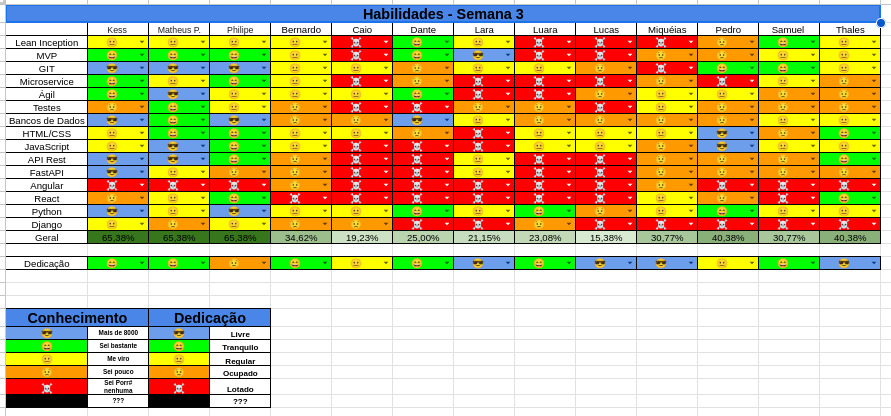

# Sprint 4

## Histórico de Revisão
| Data         | Versão | Modificação                                  | Autor(a)                |
| ------------ | ------ | -------------------------------------------- | ----------------------- |
| _19/05/2025_ | _0.1_  | _criação do documento de review da sprint 2_ | _Matheus Pimentel Leal_ |

# Review Sprint _3_
Equipe engrenou no ritmo proposto de trabalho, o que fez com que as tasks atrasadas fosse finalizadas e também pudessemos realizar a entrega de release 1. A proatividade e a participação dos membros do projeto foi o fator de maior impacto para que esta fosse a melhor sprint até o momento.

## Tasks
| ID    | Descrição                                                               |
| ----- | ----------------------------------------------------------------------- |
| _#03_ | _Protótipo de alta fidelidade_                                          |
| _#15_ | _Configuração do ambiente da API de controle e manipulação de arquivos_ |
| _#16_ | _Configuração do ambiente da API de login e autenticação_               |
| _#17_ | _Configuração do ambiente da API de controle de sessões_                |
| _#18_ | _Configuração do ambiente do projeto frontend_                          |
| _#19_ | _Criação do documento de arquitetura_                                   |
| _#20_ | _Criar landing page da wiki do projeto_                                 |
| _#21_ | _tradução das guias de contribuição_                                    |
| _#22_ | _Criar sequenciador do Lean Inception_                                  |
| _#23_ | _Criar pipelines de automação nos repositórios_                         |

## Sub-tasks
| ID    | Descrição                                |
| ----- | ---------------------------------------- |
| _#13_ | _Criação do protótipo visual do projeto_ |

### Dívidas Alocadas
| ID    | Descrição                             |
| ----- | ------------------------------------- |
| _#19_ | _Criação do documento de arquitetura_ |

## Qualidade do Trabalho Entregue
Trabalho entregue com boa qualidade, grande volume para correr atras de dividas alocadas de outras sprints

## Retrospectiva
[//]:<> (Adicionar) 
### Pontos Positivos
- Decricao das tasks ajudou bastante
- Disponibilidade de ajuda dos membros de EPS
- Sprints curtas ajudam a entender a capacidade de realizacao de tasks do time, o que ajuda no planejamento
- Comunicacao aberta no grupo (whatsapp) ajuda muito a realizar as tasks
- Boa comunicacao em sala na aula de MDS para ajuda na realizacao de tasks

### Pontos Negativos
- Falta de atencao nas comunicacoes do grupo sobre o desenvolvimento das tasks

### Pontos de Melhoria
- Criacao de novas tags para issues (Tag EPS e Tag MDS), para melhor divisao das issues no repositorio
- Designar as tasks no inicio da sprint para um responsavel
- Sempre perguntar no grupo caso nao encontre uma informacao na documentacao / encontre erro na documentacao

# Planning da Sprint _4_ ⭐ R1
- **Período:** _12/05/25 a 18/05/25_
- **Objetivo:** _Continuacao do desenvolvimento das apis e do frontend, refatoracao da tela de login para espelhar o prototipo de alta fidelidade, entregar primeira release_

## Possíveis Riscos Mapeados para a Sprint 4
- Dificuldade de instalação de ferramentas de desenvolvimento nos ambientes locais dos devs
- Provas na semana
- Gestão de tempo para dedicação à matéria
- Falta de conhecimento nas ferramentas definidas
- Planejamento das sprints no novo formato

# Quadro de Conhecimento

